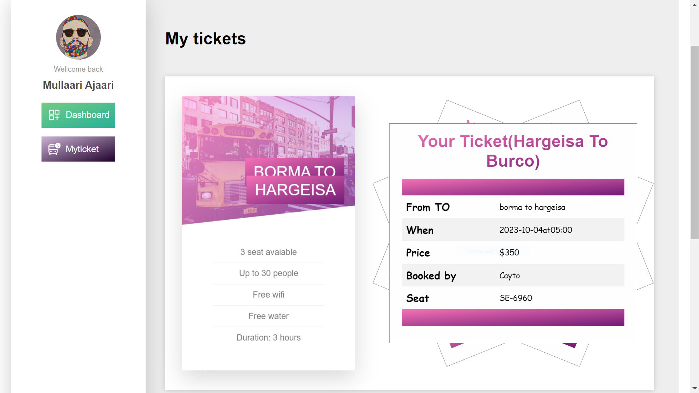

# Caraabe

## Problem Statement

Our bus company is facing challenges with inefficient scheduling and routing, resulting in delays and poor customer service.
This problem statement highlights the need for a bus transport management system that can improve scheduling and routing processes to provide better service to customers. By addressing this specific issue, the bus company can reduce delays, improve efficiency, and enhance the overall customer experience.

## Objectives

- The objectives of the project are:
  Improve scheduling efficiency: The system should be able to optimize bus schedules and routes to reduce travel time, minimize delays, and improve on-time performance.
- Enhance customer service: The system should provide real-time information on bus schedules and routes to passengers, allowing them to plan their journeys more effectively and reducing wait times at bus stops.
- Increase operational efficiency: The system should automate tasks such as scheduling, route planning, and driver management, reducing the time and resources required to manage these processes manually.
- Improve data management: The system should collect and store data on bus schedules, routes, and passenger demand, allowing operators to analyze this data and make informed decisions about service improvements.

## Methodology

One methodology that could be suitable for this project is the Agile methodology. Agile is a flexible, iterative approach to project management that emphasizes collaboration, customer feedback, and continuous improvement. This methodology involves breaking the project down into smaller, manageable tasks or iterations, with regular checkpoints and feedback from stakeholders.
The Agile methodology could be well-suited for a bus transport management system project, as it allows for flexibility and adaptability in response to changing requirements or feedback from users. It also encourages collaboration and communication between team members, which can be important for a complex project like this.

## Requirements specifications of the to-be system

Functional Requirement
From the whole view of our system, it should have significant functional requirements, including

1. Login and Registration System
2. Booking Schedule
3. Schedule and Booking Management Section
4. Buses and Routing Management Section
5. Users Management Section
6. Logout Section

## Requirements specifications of the to-be system

- Non-Functional Requirements:
  Non-functional requirements are those that specify the properties or characteristics that a bus system must possess, rather than specific functions or features. Non-functional requirements are important because they ensure that the system is reliable, performant, and secure. Here are some non-functional requirements that might apply to a bus system:
- Performance: The system must be able to handle a large number of users, transactions, and requests, while maintaining response times within acceptable limits.
- Reliability: The ability of a system or component to perform its required functions under stated conditions for a specified period of time
- Security - is the degree of resistance to or protection from harm. It applies to any vulnerable and valuable asset, such as a person Login and Registration
- Usability: The system must be easy to use and navigate for all users. The system should also be accessible on a variety of devices and platforms.
- Maintainability: The system must be easy to maintain and modify, with minimal downtime or disruptions. The system should also be well-documented, with clear instructions for developers and administrators.

## Existing System Description

An existing manual bus transport management system is a system that relies on paper-based processes and manual record-keeping to manage the operations of a bus transport company. While this system may have worked in the past, it is no longer considered an effective way to manage a modern bus transport company. There are several reasons why this system is not good:

## Conclusion

In conclusion, a Bus Transport Management System is a powerful software solution that can help bus transport companies improve their operational efficiency, reduce costs, and enhance the passenger experience. By providing a centralized platform for managing all aspects of the bus transport process including

- Scheduling
- ticketing
- fleet management
- driver management
- passenger management

# Copyright

- Copyright (c) [2023] [Aidarous Mahamed Abdi Muhumed aidarous1143@gmail.com]
- All rights reserved.